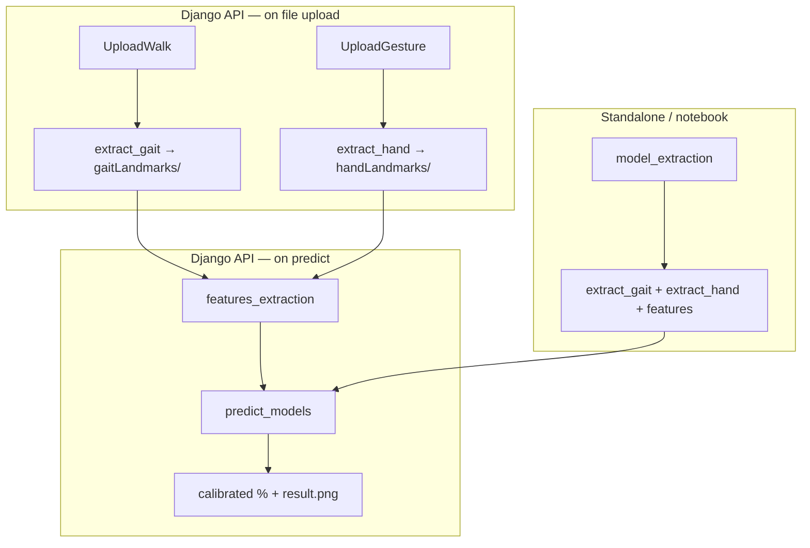

# Parkinson's Disease: Voice, Hand, and Gait Models

Multimodal feature extraction and RF-based PD screening from voice, hand-tapping video, and gait video. 

## Recent changes (API sync)

- **`deployModel.py`** — production pipeline from `pd-api-Mirlab-server/api/pdModel`:
  - `features_extraction()` — features only (landmarks must exist)
  - `model_extraction()` — full local run: extract landmarks → features
  - `predict_models()` / `predict_gait` / `predict_hand` / `predict_sound` — RF ensemble + Platt calibration
  - Updated feature sets (14 hand tapping features, 6 voice features incl. reading time & pronunciation score)
- **New modules:** `speechScoring.py`, `pd_calibration_only.py`, `pd_calibrators.json`, `generate_shap_explanations.py`, `run_hand_prediction_custom.py`
- **`settings.py`** — paths rooted under `pdmodel/` (`PD_pretrained_models`, checkpoints, landmark dirs)
- **`requirements.txt` / `setup.py`** — expanded dependencies; optional `shap` via `requirements-optional.txt`
- **`sync_from_api_pdmodel.py`** — re-sync Python files from the API repo when needed

See [`examples/django_views_integration_sample.py`](examples/django_views_integration_sample.py) for how the live Django server wires these functions (based on `pd-api-Mirlab-server/api/views.py`).

---

## Pipeline overview



| Function | Use when |
|----------|----------|
| `extract_gait(video, landmark_dir)` | Save gait 2D/3D pose files under `landmark_dir` |
| `extract_hand(video, landmark_dir, 'left'/'right')` | Save hand landmark `.txt` under `landmark_dir` |
| `features_extraction(...)` | Landmarks already exist (production API at predict time) |
| `model_extraction(...)` | Local all-in-one: extract landmarks then features |
| `model_extraction(..., skip_landmark_extraction=True)` | Same as `features_extraction` when landmarks are ready |
| `predict_models(all_feature.npy, age, gender, out_dir)` | RF predictions + calibration → `[gait%, hand%, voice%, ensemble%]` |
| `data_checking(...)` | Quality gate before prediction |

**Landmark paths (defaults in `settings.py`):**

- `pdmodel/gaitLandmarks/` — `2d_<video>.npy`, `3d_<video>.npz`
- `pdmodel/handLandmarks/` — `left_hand_<video>.txt`, `right_hand_<video>.txt`

Production server uses `/mnt/pd_app/gaitLandmarks/` and `/mnt/pd_app/handLandmarks/` (set in API `deployModel.py`).

---

## Setup

### 1. Create environment

```bash
conda create -n pdmodel python=3.8
conda activate pdmodel
```

### 2. Install dependencies

```bash
pip install -r requirements.txt
```

Optional SHAP explanations:

```bash
pip install -r requirements-optional.txt
# or: pip install .[shap]
```

### 3. PyTorch (match your CUDA version)

```bash
conda install pytorch==1.10.1 torchvision==0.11.2 torchaudio==0.10.1 cudatoolkit=11.3 -c pytorch -c conda-forge
```

### 4. OpenMMLab (gait / mmpose)

```bash
pip install -U openmim
mim install mmengine
mim install mmcv-full==1.7.0
mim install "mmdet==2.28.1"
mim install mmpose==0.29.0
```

On Windows, install [Visual Studio Build Tools](https://visualstudio.microsoft.com/downloads/) if needed for native extensions.

### 5. Checkpoints and pretrained models

- Download checkpoints: [Google Drive](https://drive.google.com/drive/folders/1-t5fXd-pe2c48fQHrZJpapY9H0K5WUvs?usp=sharing)
- Place under `pdmodel/checkpoint/` and `pdmodel/PD_pretrained_models/`
- Feature index file: `pdmodel/PD_pretrained_models/nvp_sfs_idx.txt`

### 6. Voice pronunciation scoring (optional)

`voiceFeatureExtraction` calls `speechScoring.score_pronunciation()` against a local HTTP service (default `http://localhost:8899`). Start that service before voice feature extraction, or prediction will fail on the voice step.

### 7. Configure paths

Edit `pdmodel/settings.py` for local paths. For production-like layout:

```python
HAND_LANDMARK_PATH = Path("/mnt/pd_app/handLandmarks")
GAIT_LANDMARK_PATH = Path("/mnt/pd_app/gaitLandmarks")
```

---

## Quick start (standalone)

```python
import os
from deployModel import model_extraction, predict_models, data_checking

gait_video = "path/to/walk.mp4"
left_hand  = "path/to/left.mp4"
right_hand = "path/to/right.mp4"
voice      = "path/to/voice.wav"
out_dir    = "path/to/results/run1/"
os.makedirs(out_dir, exist_ok=True)

# Quality check (optional)
success, err = data_checking(gait_video, left_hand, right_hand, voice)
print(success, err)

# Extract landmarks + build feature vector
model_extraction(gait_video, left_hand, right_hand, voice, out_dir)

# Predict (age: int, gender: 0/1)
results = predict_models(f"{out_dir}all_feature.npy", age=65, gender=1, out_dir=out_dir)
print("Gait, Hand, Voice, Ensemble (%):", results)
```

If landmarks were extracted earlier (Django-style):

```python
from deployModel import features_extraction, predict_models

features_extraction(gait_video, left_hand, right_hand, voice, out_dir)
results = predict_models(f"{out_dir}all_feature.npy", age=65, gender=1, out_dir=out_dir)
```

---

## Probability calibration (`pd_calibration_only.py`)

Raw RF outputs from `predict_models()` are **Platt-scaled** before being shown as percentages. This corrects probability scores using labeled PD vs healthy reference data.

### How it works at inference

1. `deployModel.predict_models()` runs RF on gait, hand, and voice features and builds a weighted ensemble.
2. Raw scores (0–100 scale) are passed to `calibrate_new_predictions()` in `pd_calibration_only.py`.
3. Each modality uses a saved linear calibrator: `logit(p_cal) = coef * logit(p_raw) + intercept`.
4. Calibrated values are returned as `[gait%, hand%, voice%, ensemble%]` and written to `result.png` when `out_dir` is set.

Bundled parameters live in **`pdmodel/pd_calibrators.json`** (one calibrator per output: `gait`, `voice`, `tapping` [hand], `ensemble`).

```python
# Inside deployModel.predict_models() (simplified)
raw_results = {
    "gait": float(gait_result["RF"][0]) * 100,
    "voice": float(voice_result["RF"][0]) * 100,
    "hand": float(hand_result["RF"][0]) * 100,
    "ensemble": float(all_result["RF"][0]) * 100,
}
calibrated = calibrate_new_predictions(raw_results, CALIBRATOR_PATH)
```

Hand scores use the key **`tapping`** inside the calibrator bundle; public API dicts use **`hand`** (mapped automatically).

### Retrain calibrators (CLI)

Requires Excel workbooks with columns for `gait`, `voice`, `tapping` (hand), and `ensemble` (plus an ID column), plus `openpyxl`:

```bash
cd pdmodel

# Fit Platt parameters from PD + healthy elder labeled probabilities
python pd_calibration_only.py train \
  --pd-file path/to/pd_probabilities.xlsx \
  --elder-file path/to/elder_probabilities.xlsx \
  --output pd_calibrators.json

# Optional: include a previous test CSV
python pd_calibration_only.py train \
  --pd-file pd.xlsx \
  --elder-file elder.xlsx \
  --previous-test-file previous_test.csv \
  --output pd_calibrators.json
```

Apply to a single raw prediction (0–100 or 0–1; auto-detected):

```bash
python pd_calibration_only.py apply \
  --calibrators pd_calibrators.json \
  --gait 61 --voice 44 --hand 55 --ensemble 58
```

### Use in Python

```python
from pd_calibration_only import calibrate_new_predictions, train_calibration_bundle, save_calibration_bundle

# Apply bundled calibrators (returns 0–1 probabilities)
out = calibrate_new_predictions(
    {"gait": 61.2, "voice": 44.0, "hand": 55.1, "ensemble": 58.3},
    "pdmodel/pd_calibrators.json",
)
# out -> {"gait": 0.xx, "voice": 0.xx, "hand": 0.xx, "ensemble": 0.xx}
```

This module does **not** retrain the RF models — only post-hoc probability calibration.

---

## Module map

| Module | Role |
|--------|------|
| `voiceFeatureExtraction.py` | Audio + pronunciation features |
| `handFeaturesExtraction.py` | Tapping features from hand landmarks |
| `gaitFeaturesExtraction.py` | Gait features from 2D/3D pose |
| `handExtraction.py` / `gaitExtraction.py` | MediaPipe hands / mmpose gait landmarks |
| `deployModel.py` | Orchestration, prediction, calibration |
| `pd_calibration_only.py` | Train/apply Platt calibrators |
| `speechScoring.py` | Pronunciation score via HTTP API |
| `generate_shap_explanations.py` | Optional SHAP plots |
| `sync_from_api_pdmodel.py` | Sync code from `pd-api-Mirlab-server/api/pdModel` |

---


## Install as package

```bash
pip install -e .
```

---

## Production Django integration

The deployed app (`pd-api-Mirlab-server`) does **not** call `model_extraction`. It splits work across upload and predict — see **`examples/django_views_integration_sample.py`** for a documented mirror of `api/views.py`.
